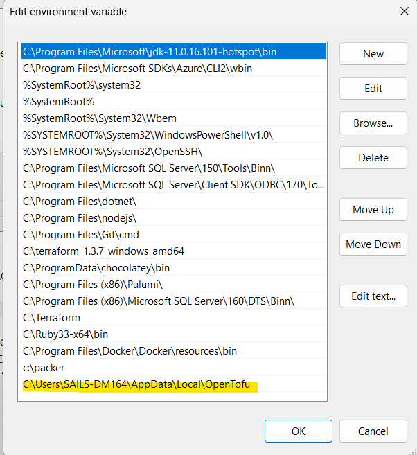
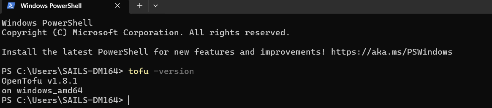
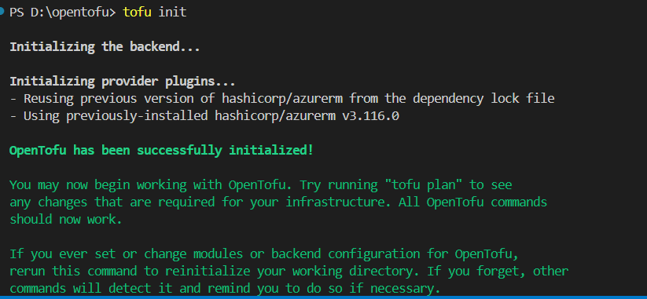
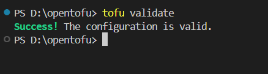
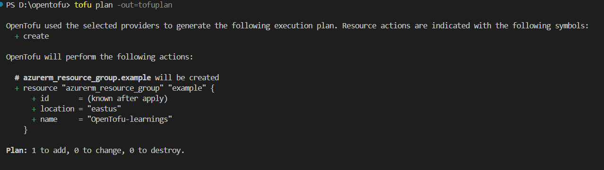
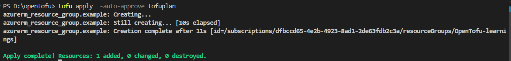
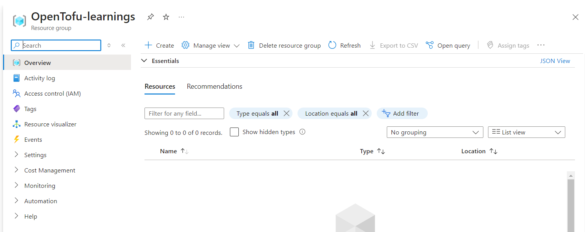

# Begin Your Journey with OpenTofu-Installation and Azure Resource Group Creation

In this article we will discuss the following:

**What is OpenTofu**
The open source infrastructure as code tool.Previously named OpenTF, OpenTofu is a fork of Terraform that is open-source, community-driven, and managed by the Linux Foundation.

**Difference between OpenTofu and Terraform**
The key distinction between OpenTofu and Terraform lies in their licensing. OpenTofu is open-source under the MPL 2.0 license, making it a community-driven project where the community can directly shape the development of features. In contrast, Terraform operates under the BSL, with its development and feature set primarily driven by its vendor, HashiCorp.

**Installing OpenTofu on Windows using powershell**
Find the latest release version at this URL: [OpenTofuReleases](https://github.com/opentofu/opentofu/releases).

```
$TOFU_VERSION="1.8.1"
$TARGET=Join-Path $env:LOCALAPPDATA OpenTofu
New-Item -ItemType Directory -Path $TARGET
Push-Location $TARGET
Invoke-WebRequest -Uri "https://github.com/opentofu/opentofu/releases/download/v${TOFU_VERSION}/tofu_${TOFU_VERSION}_windows_amd64.zip" -OutFile "tofu_${TOFU_VERSION}_windows_amd64.zip"
Expand-Archive "tofu_${TOFU_VERSION}_windows_amd64.zip" -DestinationPath $TARGET
Remove-Item "tofu_${TOFU_VERSION}_windows_amd64.zip"
$TOFU_PATH=Join-Path $TARGET tofu.exe
Pop-Location
echo "OpenTofu is now available at ${TOFU_PATH}."
```

Please make sure to add it to your path in system variables for easier access.



Now, open vscode or any of your favorite code editor using bash or shell type in:

```
tofu -version
```

This will display the following:



create new directory (opentofu) and file inside name it (main.tf)

```
mkdir opentofu && cd opentofu
code .
```

Let's create a provider.tf file and the following code snippet.

provider.tf

```
terraform {
  required_providers {
    azurerm = {
      source  = "hashicorp/azurerm"
      version = "3.116.0"
    }
  }
}

provider "azurerm" {
  features {}
}
```

Save the file.

Let's create main.tf and variables.tf files.

main.tf

```
resource "azurerm_resource_group" "example" {
  name     = var.resource_group_name
  location = var.resource_group_location
}
```

variables.tf

```
variable "resource_group_location" {
  type        = string
  default     = "eastus"
  description = "Location of the resource group."
}

variable "resource_group_name" {
  type    = string
  default = "OpenTofu-learnings"
}
```

Let's initialize OpenTofu

```
tofu init
```

The Output:



Let's validate the configuration files

```
tofu validate
```

The Output:



After validating the configuration files, we use `tofu plan` to generate a plan of proposed actions and simulate a 'Dry Run' to preview changes before applying them.

```
tofu plan
```

The Output:



Finally, the `tofu apply` command applies the changes from your configuration files to the infrastructure, including creating, updating, or deleting resources.

```
tofu apply  -auto-approve tofuplan
```

The Output:



Check the portal to view the resources present. In our case, it’s a simple resource group deployment, but it could involve more complex deployments.



Conclusion:

**OpenTofu** is a powerful infrastructure-as-code tool similar to Terraform, allowing programmatic management of cloud and IT resources. It supports planning, applying changes, and managing infrastructure states with integration for providers like Azure and AWS.

